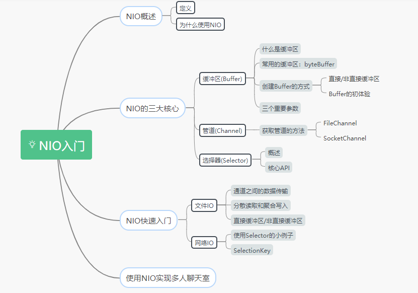

JAVA NIO

1.核心概念 ByteBuffer channel selector

2.selector方法 selector.keys 返回当前所有注册在selector中channel的selectionKey selector.selectedKeys() 返回注册在selector中等待IO操作(及有事件发生)
channel的selectionKey

3.参考资料：
https://mp.weixin.qq.com/s/GfV9w2B0mbT7PmeBS45xLw?spm=a2c6h.12873639.article-detail.7.53064a61zoh75U
